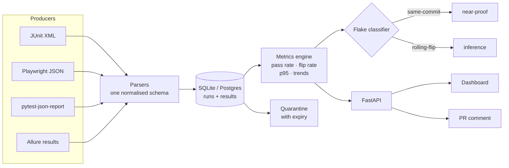

# TestPulse

**Test observability and flake detection for CI suites.** Ingests results over
time, works out which tests are actually flaky rather than merely failing, and
says what changed since the last run.

[](https://github.com/Mohanad49/testpulse/actions/workflows/ci.yml)

---

## The problem

A regression suite in CI has no memory. Every run is judged in isolation, which
means the two situations that need completely different responses look
identical:

- a test that fails intermittently because of a race condition
- a test that started failing on Tuesday because someone broke it

Both show up as red. So the suite gets a retry bolted on, the red goes away, and
the real bug ships. Or the test gets skipped "temporarily" and nobody ever
un-skips it.

The information needed to tell them apart exists — it is just thrown away at the
end of every run. TestPulse keeps it.

I built this after spending a year on a QA team where "is that test flaky or did
I break it?" was a question we answered by asking each other.

## What it does



Four report formats in, one schema out, metrics computed over a rolling window,
surfaced through a REST API, a dashboard and a pull-request comment.

## The interesting part: two flake strategies, because one is not enough

**`same-commit` — near-proof, low recall.** If one commit produced two different
outcomes, the code did not change and the result did. Two sources: two runs of
the same SHA disagreeing, or a single result that was retried and went green
(runners only retry a test that did not pass). Almost no false positives. Finds
nothing at all unless your suite retries or CI runs a commit twice.

**`rolling-flip` — works anywhere, lower precision.** Flaky if pass rate is
between 0.05 and 0.95 **and** flip rate exceeds 0.20, over at least 5 scored runs.

Every threshold is doing a job:

| Gate | Excludes |
|---|---|
| pass rate > 0.05 | Tests that always fail. Predictable ≠ flaky — that one is just broken |
| pass rate < 0.95 | One unlucky failure in fifty runs. A bad night, not a pattern |
| flip rate > 0.20 | **The one that matters.** A test that passed 30× then failed 20× has a pass rate of 0.6 — dead centre of the band — but flipped *once*. That is a regression with a specific cause, and calling it flaky sends someone hunting a race condition that does not exist |
| ≥ 5 scored runs | Two runs, one pass one fail: pass rate 0.5, flip rate 1.0, clears everything. Far more likely a regression than a flake |

Nothing is hardcoded. `testpulse.toml`, or `TESTPULSE_FLAKE__FLIP_RATE_THRESHOLD`
and friends. "Is this flaky" is a policy question and two teams can reasonably
disagree.

### Reading the score

`flakiness_score = flip_rate × 4p(1−p)`. The parabola peaks at a 50% pass rate
and hits zero at both extremes, so an always-failing test scores 0. Multiplying
by flip rate separates a coin-toss from a clean regression with the same pass
rate.

**It describes `rolling-flip` only.** A `same-commit` finding can legitimately
score 0.00 — one run, retried, went green: pass rate 100%, flip rate 0. Sorting
on the score alone put the most conclusively flaky test in the suite at the
bottom of the leaderboard. That was a real bug, found by running real data
through it.

## The dashboard

Dark by default, five views, and one piece of it worth looking at closely.

**The status timeline** is one cell per run, oldest first, so a flake pattern
reads without a number. The design constraint that shaped it: roughly one man in
twelve has a colour vision deficiency, red/green is exactly the pair they cannot
separate, and red/green is the first thing every test tool reaches for.

So colour is never the only channel. Every cell carries a distinguishable glyph
(`▍` passed, `✕` failed, `!` error, `–` skipped). Printed greyscale, screenshotted
into a report, or viewed with deuteranopia, the pattern still reads. A pass that
only happened after a retry gets a third channel — an outline — because that
single cell is same-commit flake evidence on its own and must not look like an
ordinary pass.

Accessibility is enforced rather than assumed: axe runs in the component tests
**and** per view per theme in the E2E suite, and one test asserts axe reports
violations on broken markup so a green suite means something.

## The PR comment reports changes, not state

```
## TestPulse
⚠️ 1 newly failing in `orangehrm-e2e`.

`7` tests · 4 passed · 3 failed · 0 errored · 0 skipped
2 test(s) were already failing before this run and are not listed.

🔴 Started failing
- `Apply for leave (or verify leave balance status)` — passed 57% of its last 7 runs
```

"47 tests failed" is useless in a pull request because 45 of them were already
failing on main. Pre-existing failures are counted and deliberately **not**
listed — listing them is how the comment becomes a wall of red people scroll past.

## Quarantine expires

Quarantining is a recorded human decision with a name on it, not something the
classifier does at 3am. Every entry expires after 14 days by default, and expiry
does **not** re-enable the test or delete the entry. It just stops the list being
quiet about age, so a quarantine list cannot silently become a graveyard of tests
nobody remembers disabling.

Overdue entries report *how* overdue. "Expired" is ignorable; "expired 47 days
ago" is not.

## Running it

```bash
docker compose up --build      # dashboard :8080, API :8000
```

Or piecemeal:

```bash
uv sync
cd packages/testpulse-core && uv run --project .. alembic upgrade head

uv run testpulse ingest --format junit --path ./reports/junit.xml \
  --suite admin-portal-e2e --commit "$GITHUB_SHA" --branch main --env chrome-ci

uv run testpulse flaky   --suite admin-portal-e2e            # with evidence
uv run testpulse report  --suite admin-portal-e2e            # what changed
uv run testpulse quarantine list --suite admin-portal-e2e --format pytest-deselect

uv run uvicorn testpulse_api.main:app --reload                # API + /docs
cd packages/testpulse-web && pnpm install && pnpm dev         # dashboard
```

In CI:

```yaml
- uses: Mohanad49/testpulse@main
  with:
    path: ./playwright-report.json
    format: playwright
    suite: admin-portal-e2e
    database-url: ${{ secrets.TESTPULSE_DATABASE_URL }}
```

Exit codes are distinct because that is all a pipeline reads reliably: `2`
unparseable report, `3` already ingested, `4` bad usage, `5` something got worse.
`3` is frequently fine and `2` never is.

## Formats

| Format | Input | Reports retries |
|---|---|---|
| JUnit XML | file | no |
| Playwright JSON | file | **yes** |
| pytest-json-report | file | no |
| Allure results | directory | not yet |

That column is the single most consequential thing on this page. `same-commit`
detection needs retry data, and only one of these four provides it — which is why
`retry_count` is nullable and `NULL` is not `0`. A format that *cannot* report
retries must not look like one reporting none, or the strategy runs happily and
finds nothing while appearing to work.

## Testing

```bash
uv run --directory packages/testpulse-core pytest      # 217
uv run --directory packages/testpulse-api  pytest      # 68
uv run mypy --strict packages/testpulse-core/src packages/testpulse-api/src
uv run ruff check .

cd packages/testpulse-web
pnpm test        # 8 component + axe
pnpm e2e         # 21 Playwright, incl. 10 axe scans (5 views × 2 themes)
```

Two things I would want a reviewer to notice:

**Fixtures are real reporter output**, captured from real suites or produced by
running a throwaway one. Never hand-written. A fixture I write encodes the same
assumptions as the parser I am testing, so it passes while the parser fails on a
real report. Using real files found three bugs immediately — including that Allure
attachments live nested inside steps, not on the result (0 of 270 real results had
a top-level attachment; 47 had nested ones), so the obvious implementation returns
an empty list for every test and *looks* correct.

**The meta-tests.** The OpenAPI contract suite has a test asserting the validator
rejects a broken payload, and the accessibility suite has a test asserting axe
reports violations on broken markup. A green suite is only evidence if the
checker is demonstrably running — and my first contract-test implementation did
silently resolve nothing.

## Design decisions

[DECISIONS.md](DECISIONS.md) — one section per phase, every entry with the
alternative rejected and what it costs. It also records what I got wrong:

- an `allow_duplicate` flag the unique constraint made impossible
- reading `pytest-json-report`'s `created` as a start time when it is the end
- a long-broken test reported as newly failing because the last entry in its
  history was a skip
- concluding light-mode contrast was clean when it was not, because I trusted a
  scan of a page I had hand-mutated from the console

## Deployment

`fly.toml` (API, scale-to-zero + managed Postgres) and `vercel.json` (dashboard,
proxying `/api` to the same origin — same paths in dev, Docker and production, so
there is no CORS configuration anywhere).

`POST /api/ingest` requires `Authorization: Bearer <key>` when
`TESTPULSE_INGEST_KEYS` is set, and **the app refuses to boot** when
`TESTPULSE_ENV=production` and no key is configured. Reads stay open — the
dashboard's whole purpose is being linkable.

> **Not currently deployed.** The configs are written and the auth gap is closed,
> but no live instance exists yet, so there is no demo link on this page. I would
> rather have no link than one pointing at nothing.

## What I would build next

In rough order of what I would actually reach for first:

1. **Make the action POST to the API.** It writes to the database directly today,
   which means handing every CI job a production database credential — worse than
   a scoped API key. The endpoint and auth exist; the CLI cannot target them yet.
2. **Reconstruct Allure retries** by correlating `historyId` across result files.
   That would let `same-commit` read Allure data, which is currently the largest
   blind spot.
3. **Split an accumulated Allure directory into runs.** The parser detects the
   condition and warns; deciding what separates two runs is the hard part and I
   did not want the parser guessing.
4. **A materialised metrics table refreshed on ingest.** Every request recomputes
   the whole window from raw rows. Fine at this size; the fix is not a cleverer
   query.
5. **Failure clustering by embedding rather than template match.** Exact template
   matching biases hard toward splitting, which is the right default — a false
   merge hides a second bug inside a cluster that already looks explained — but it
   misses genuinely-same failures worded differently.

## Layout

```
packages/testpulse-core   parsers, metrics, flake classifier, quarantine, CLI
packages/testpulse-api    FastAPI over the stored data
packages/testpulse-web    React dashboard
action.yml                composite GitHub Action
docker/                   API and web images
scripts/seed_e2e.py       seeds a database from committed fixtures
```
